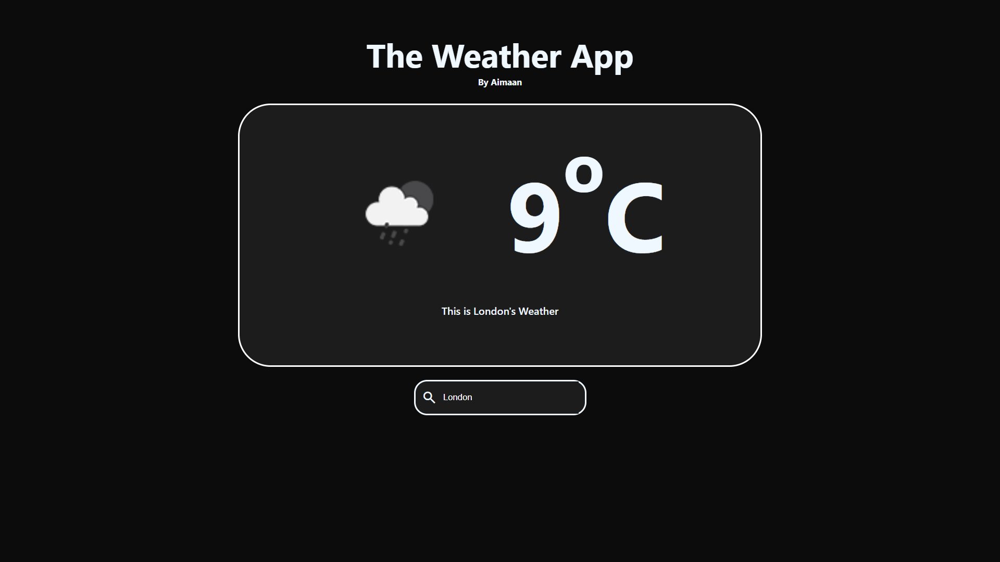

# 🌦️ The Weather App
**A sleek, mobile-responsive weather dashboard.**

## 📌 Overview
This is a web application built to provide real-time weather updates. As a student developer, I focused on creating a clean UI that works perfectly on both desktop and mobile devices.

## 🚀 Features
* **Real-time Search:** Fetches live data using the OpenWeather API.
* **Responsive Design:** Fully optimized for all screen sizes.
* **Clean UI:** Minimalist dark mode aesthetic.

## 🛠️ Tech Stack
* HTML5, CSS3, and Vanilla JavaScript.
